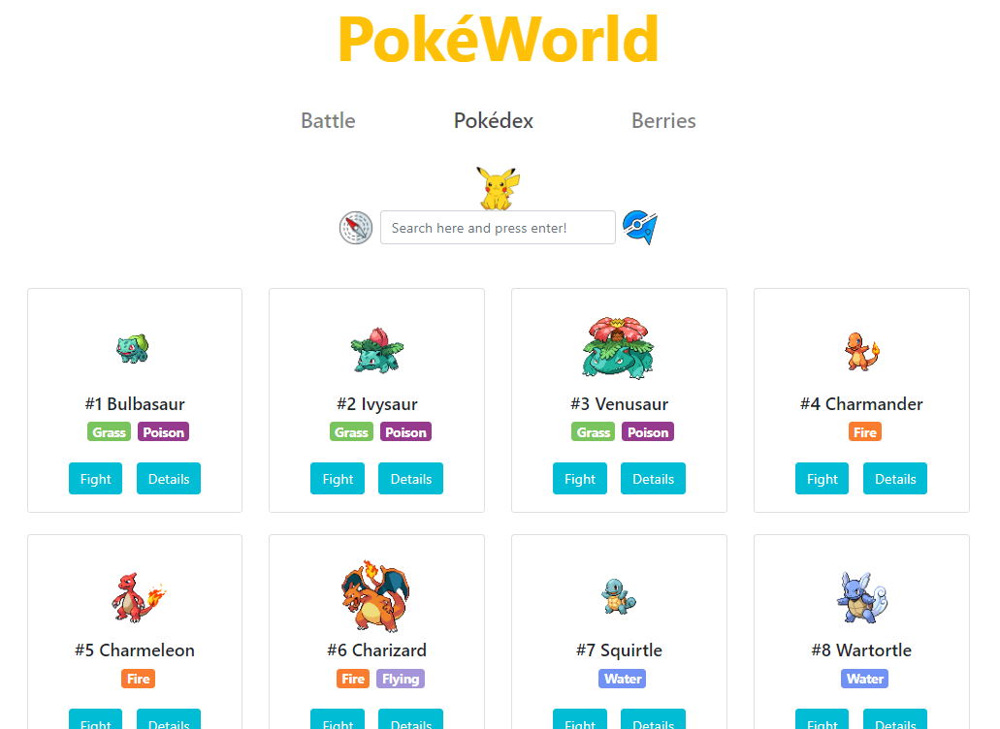
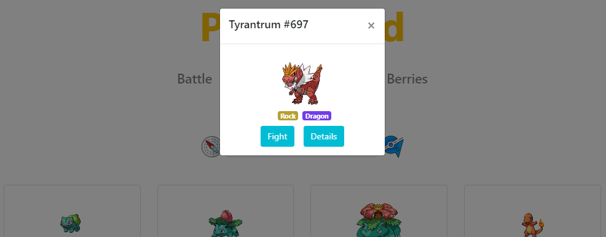
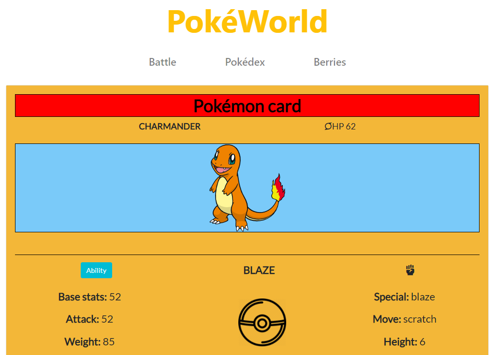
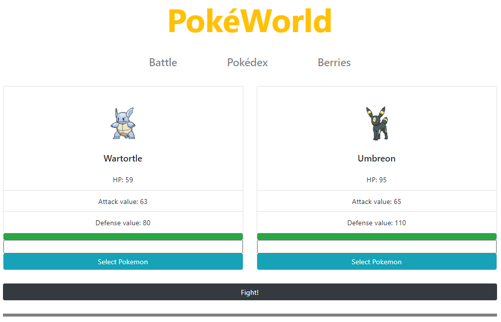
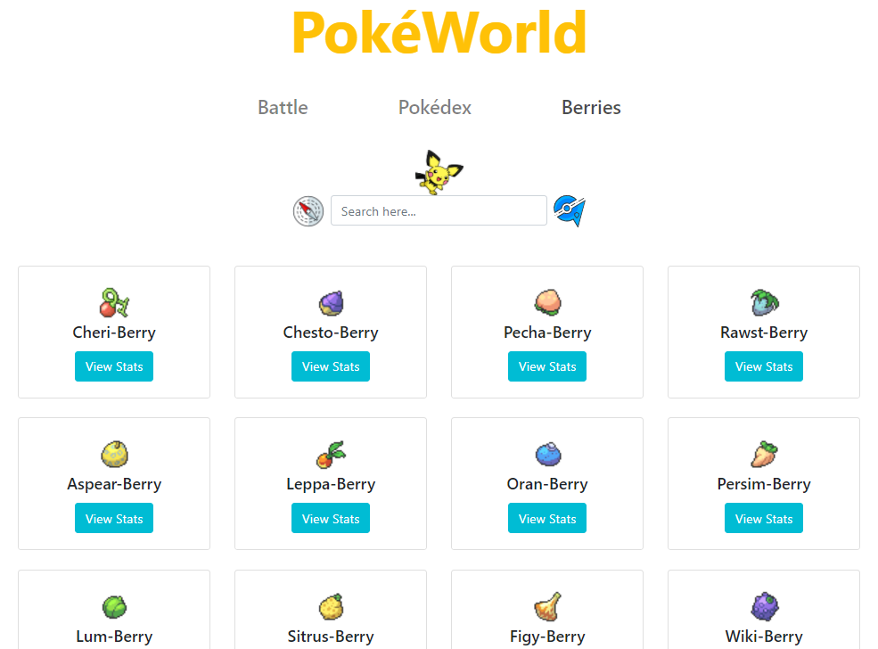

# PokéWorld

## Description

This group work will provide you more details and information about the creatures called [Pokémon](https://en.wikipedia.org/wiki/Pok%C3%A9mon).

On the website you will have the chance to:

- Find and/or discover new Pokémons
  
  
  
- Simulate a battle between them with their own original combat stats
  
- Gather information on Pokémon Berries
  

The project is going to demonstrate how React can be used for creating website and how to fetch data from a public API.

**Tech Stack** used in this project:

- [HTML5](https://developer.mozilla.org/en-US/docs/Web/HTML)
- [CSS3](https://developer.mozilla.org/en-US/docs/Glossary/CSS)
- [JavaScript](https://developer.mozilla.org/en-US/docs/Glossary/JavaScript)
- [Bootstrap](https://developer.mozilla.org/en-US/docs/Glossary/Bootstrap)
- [React](https://reactjs.org/)
- [ReactRoute](https://reactrouter.com/)

## Usage

Inside the Pokédex page, if you want to discover new Pokémons insert a number bewteen 1 and 807 or simply input the name of your favorite Pokémon, you can also explore the details with the buttons provided in the pop-up.
There is the chance to load more pokemon using the Load Button at the very end of the page.

You can simulate a battle into the Battle component, you can either chose 2 new Pokémons or chose only 1 if you previously imported from Pokédex with the Battle Button. When two Pokémons are selected, press the Fight Button to see who will win.

Finally, if you want to gather more information on Berries, you can navigate inside the Berries component and check the details using the button Stats.

## Installation

At the moment the project is only available on local installation.

If you are into coding

1. Download the repository [here](https://github.com/simo54/pokedexwbs/archive/master.zip) or under the button "Code" from the repository
2. Inside your Code Editor use `npm install` to install the necessary nodes
3. Launch the project on your localhost to start playing!

If you are **NOT** into coding

1. Download and install a Coding text editor (examples are [Visual Studio Code](https://visualstudio.microsoft.com/), [Atom](https://atom.io/))
2. Install [Node.js](https://nodejs.org/en/) (Recommended version)
3. Inside your Code Editor, open the console and use `npm install` to install all the necessary nodes
4. When its done, launch the project on your console with the command `npm start`, it will open a webpage in your default browser to start playing!

## Contribute

If you wish to help and contribute on the project please open an issue on github with your suggestions and/or your code implementation.

## Credits

This group work made possible thanks to the work of [Zee](https://github.com/zeelib1), [Josh](https://github.com/koedukativ) and [Simone](https://github.com/simo54) .

- Tab Icon was provided by [Those Icons](https://www.flaticon.com/authors/those-icons)
- Icon Pichu was provided by [Uokpl](https://www.uokpl.rs/)
- Icon Pikachu was provided by [freepngimg](freepngimg.com)
- Icon Navigation was provided by [Icons-Icons](icon-icons.com/)
- Icon Gym Badge was provided by [Roundicons-freebies](https://www.flaticon.com/authors/roundicons-freebies)
- All information related to Pokémons has been taken from [PokeApi](https://pokeapi.co/)
